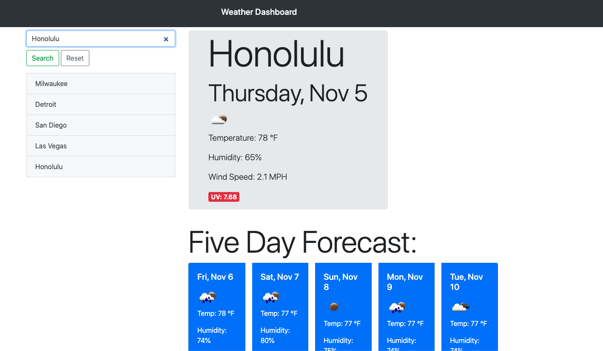

# weather-dashboard-pbm

This work day scheduler is intended to provide a basic workday scheduler that stores notes in localstorage and updates the timeblocks based on time of day.

# Installation

1. Open Browser
2. Navigate to https://pmo48.github.io/weather-dashboard-pbm/

# Usages

- Giving 100% on homework
- Displaying 3rd-party API logic
- Displaying weather from different cities

# Credits

naldz - https://naldzgraphics.net/free-weather-icons/
openweather - https://openweathermap.org/api
bootstrap - https://getbootstrap.com/
jquery - https://jquery.com/
moment - https://momentjs.com/
